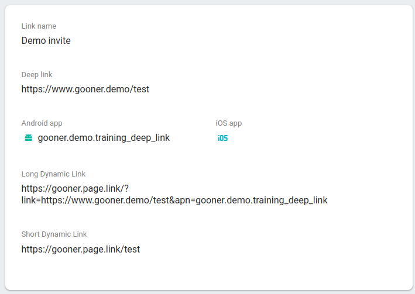
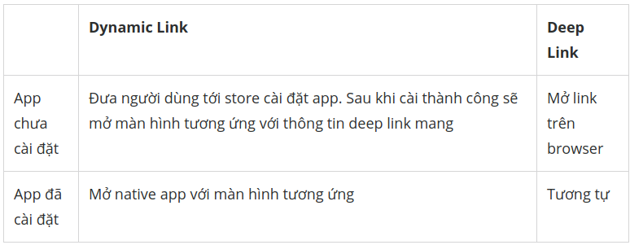

# Training_Deep_link

## I. Khái niệm

### 1. Deep link là gì ?

Là thành phần giúp di chuyển giữa web và ứng dụng. Chúng đơn giản là URL mà giúp di chuyển tới thành phần nào đó của ứng dụng.

Tuy nhiên nếu ứng dụng khác trong thiết bị có thể xử lý cùng loại Intent, thì người dùng có thể sẽ không đi thẳng đến app. 


Có một khái niệm khác là App link. Nó cũng chính là deep link mà đã được xác thực là thuộc về app của mình. Khi nhấn vào URL, nó sẽ mở luôn app, không hiển thị dialog chọn ứng dụng

### 2. Kịch bản từ Deep link tới nội dung app

Khi click một URl, hệ thống Android sẽ làm từng bước sau, theo tuần tự, cho đến khi thành công

- Mở ứng dụng ưa thích của người dùng có thể xử lý URL

- Mở ứng dụng duy nhất có thể xử lý URL

- Cho phép người dùng chọn ứng dụng từ dialog 

### 3. Lấy Parameter từ Deep link


Câu lệnh

```
adb shell 'am start 
-W -a android.intent.action.VIEW 
-d "http://www.testapp.com/main?id=12345&name=Trung" 
gooner.demo.training_deep_link'

``` 

Code để lấy, trong onCreate hoặc onStart

```
        val data = intent?.data.let {
            Log.d("Data11", " " + it?.getQueryParameter("id"))
            Log.d("Data11", " " + it?.getQueryParameter("name"))
        }
```

### 4. Deeplink với Navigation Component

### a. Một số vấn đề khi sử dụng deeplink như sau:

### 1. Phải tạo nhiều link ở file manifest, bao gồm cả http và https

### 2. Xử lý parameters trong link

Case 1

```
val myUri = Uri.parse(myLink) // http://mysite.com?myParam=VALUE
val myParamValue = myUri.getQueryParameter("myParam")
```

Case 2

```
val myUri = Uri.parse(myLink) // http://mysite.com/VALUE/stuff
val myParamValue = myUri.pathSegments[0]
```

### 3. Xử lý di chuyển màn khi mở link


Navigation sẽ giúp khắc phục các vấn đề này 

1.
```

<fragment
    android:id="@+id/pagesListFragment"
    android:name="com.ekalips.navigatortest.pages.PagesListFragment"
    android:label="Pages"
    tools:layout="@layout/fragment_pages_list">
    <action
        android:id="@+id/viewPage"
        app:destination="@id/pageFragment"/>
    <deepLink app:uri="myapp.com" />
</fragment>
```

URI ko có scheme => Schema sẽ được coi là  **http** hay **https**

2. 

```
<fragment
    android:id="@+id/pageFragment"
    android:name="com.ekalips.navigatortest.page.PageFragment"
    android:label="Page"
    tools:layout="@layout/fragment_page">
    <argument
        android:name="title"
        app:type="string" />

    <argument
        android:name="detail"
        app:type="string" />

    <action
        android:id="@+id/viewPageComments"
        app:destination="@id/pageCommentsFragment"/>
    <deepLink app:uri="myapp.com/{title}/{detail}" />
</fragment>
```

Các tham số được viết trong dấu {} và thẻ <argument>. Muốn nhận ta đơn giản chỉ cần gọi getArguments() rồi get ra thuộc tính là xong

Có thể sử dụng Safe Args để tiện cho việc lấy dữ liệu

3. Về cơ bản nó sẽ lấy theo file navigation graph ta tạo ra (tùy theo loại deep link), từ đó đơn giản hóa việc tạo di chuyển

### b. Phân loại

Có 2 loại deep link:

- Explicit: sử dụng PendingIntent, thường dùng trong notification, app widget

- Implicit: sử dụng URI, khi nhấn vào thì mở apps

### 5. DynamicLink của Firebase

### a. Khái niệm

 DynamicLink FireBase là các link liên kết hoạt động theo cách bạn muốn, nó sử dụng được trên nhiều nền tảng (iOS, Android, Web) và cho dù ứng dụng của bạn đã được cài đặt hay chưa. 

 Có thể tạo bằng cách sử dụng Firebase console, REST API, iOS hoặc Android Builder API, hoặc thêm tham số Dynamic Link tới domain của app. 

Lợi ích: 

- Có thể làm tăng lượt người sử dụng app từ web

- Quảng cáo đơn giản hơn, chỉ cần gửi link là được


- Chia sẻ nội dung của app dễ hơn, trên bất kì nền tảng nào, hay đã dùng app hay chưa

Cách hoạt động


### b. Cách khởi tạo

- Sử dụng Firebase console: đơn giản, với mục đích để test hoặc cho đội marketing dễ quảng cáo app




### c. So sánh

- Dynamic Link vs Deep Link

Dynamic link bao gồm cả deeplink + một số thông tin khác như package name, version, link khi không cài được app (afl), ...

So sánh



- Long vs short dynamic link

+ Long: chứa đầy đủ thông tin như package android, ios, parameter

+ Short: link rút gọn, che giấu đi thông tin


```
Long Dynamic Link

https://gooner.page.link/?link=https://gooner.demo/main/?title%3DHappy-to-meet-you-kaka11111&apn=gooner.demo.training_deep_link

Short Dynamic Link

https://gooner.page.link/main 

```

Trong code gen ra bằng **buildDynamicLink()** và **buildShortDynamicLink()**


## II. Code

### 1. Code deep link cơ bản

- Thêm <action> **ACTION_VIEW**: để intent filter có thể tìm từ Google Search

```
  <action android:name="android.intent.action.VIEW"/>
```

- Thêm thẻ <data>

```
 <data android:scheme="http"
                      android:host="www.example.com"/>

 <data android:scheme="app"
                      android:host="open.my.app"
                      android:pathPrefix="/main"/>
```

- Thêm thẻ <category>

```
// Để có thể mở app từ trình duyệt

<category android:name="android.intent.category.BROWSABLE"/>

// Mở app từ implicit intent, nếu đúng component name thì app có thể được mở 

<category android:name="android.intent.category.DEFAULT"/>
```

Cùng 1 activity có thể có nhiều intent filter với thẻ <data> khác nhau

```
<activity
    android:name="com.example.android.GizmosActivity"
    android:label="@string/title_gizmos" >
    <intent-filter android:label="@string/filter_view_http_gizmos">
        <action android:name="android.intent.action.VIEW" />
        <category android:name="android.intent.category.DEFAULT" />
        <category android:name="android.intent.category.BROWSABLE" />
        <!-- Accepts URIs that begin with "http://www.example.com/gizmos” -->
        <data android:scheme="http"
              android:host="www.example.com"
              android:pathPrefix="/gizmos" />
        <!-- note that the leading "/" is required for pathPrefix-->
    </intent-filter>
    <intent-filter android:label="@string/filter_view_example_gizmos">
        <action android:name="android.intent.action.VIEW" />
        <category android:name="android.intent.category.DEFAULT" />
        <category android:name="android.intent.category.BROWSABLE" />
        <!-- Accepts URIs that begin with "example://gizmos” -->
        <data android:scheme="example"
              android:host="gizmos" />
    </intent-filter>
</activity>
```

Và nếu viết như trên thì chỉ có https://www.example.com và app://open.my.app là có thể dẫn tới app

Nếu viết như sau

```
<intent-filter>
  ...
  <data android:scheme="https" android:host="www.example.com" />
  <data android:scheme="app" android:host="open.my.app" />
</intent-filter>
```
Thì sẽ tạo ra 4 URL có thể dẫn tới app.


